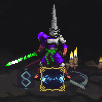

  
  <h2 align="center">-Rueda de Plegarias-</h2>
  

 

---

  
  
  

---

## Tabla de Contenidos

- [Instalación](https://github.com/NeonPixels/blasphemous.prayer-wheel/blob/main/README.es.md#instalacion)
- [Créditos](https://github.com/NeonPixels/blasphemous.prayer-wheel/blob/main/README.es.md#creditos)
- [Información del mod](https://github.com/NeonPixels/blasphemous.prayer-wheel/blob/main/README.es.md#informacion-del-mod)
  - [Preguntas Frecuentes](https://github.com/NeonPixels/blasphemous.prayer-wheel/blob/main/README.es.md#preguntas-frecuentes)
  - [Notas importantes](https://github.com/NeonPixels/blasphemous.prayer-wheel/blob/main/README.es.md#notas-importantes)
- [Enlaces](https://github.com/NeonPixels/blasphemous.prayer-wheel/blob/main/README.es.md#enlaces)

---

## Creditos

- Ayuda de programación e inspiración - [BrandenEK](https://github.com/BrandenEK)

Agradecimientos especiales a toda la gente del Discord de Modding de Blasphemous por su apoyo.

---

## Instalacion

Instalador de Mods:
- El mod puede ser instalado usando [Blasphemous Modding Installer](https://github.com/BrandenEK/Blasphemous.Modding.Installer)

Instalación manual:
1. Comprueba los requisitos de la ultima entrega del mod en la página de [Entregas](https://github.com/NeonPixels/blasphemous.prayer-wheel/releases)
2. Descarga la versión requerida de la [Modding API](https://github.com/BrandenEK/Blasphemous-Modding-API/releases)
3. Sigue las instrucciones allí sobre como instalar la API, toma nota de la ubicación de la carpeta `Modding`
4. Descarga la ultima entrega del mod de la página de [Entregas](https://github.com/NeonPixels/blasphemous.prayer-wheel/releases)
5. Descomprime los contenidos de el archivo `PrayerWheel.zip` dentro de la carpeta `Modding`

Desinstalación manual:
Elimina los siguientes archivos y carpetas de la carpeta `Modding`:
- `plugins\PrayerWheel.dll`
- `data\PrayerWheel\`
- `localitazion\PrayerWheel.txt`

<b>Nota:</b> Cuando se actualiza manualmente a una nueva versión del mod, se recomienda eliminar manialmente los archivos de la versión anterior, dado que si hay archivos que se han eliminado de la nueva versión, estos no será eliminados automaticamente al instalar manualmente.

---

## Informacion del mod

Rueda de Plegarias es una modificación (mod) de [Blasphemous](https://thegamekitchen.com/blasphemous/) que permite seleccionar la plegaria activa sin necesidad de abrir el menú de inventario, mediante una interfaz rotatoria.

  

- Mantener pulsada la tecla de `usar` para mostrar la rueda de selección.
- Pulsar las teclas configuradas para rotar la rueda.
- Las teclas pueden configurarse editando el siguiente archivo en la carpeta del juego: `Modding\keybindings\PrayerWheel.txt`
- Referencia de los códigos de teclas: [Documentación de Unity](https://docs.unity3d.com/2017.3/Documentation/ScriptReference/KeyCode.html)

### Preguntas Frecuentes

### Notas importantes

- Solo funciona con la versión más reciente del juego: `4.0.67`

## Enlaces

- [Página Oficial de Blasphemous](https://thegamekitchen.com/blasphemous/)
- [Discord de Modding de Blasphemous](https://discord.gg/pddcGqPH)
- [Discord General de Blasphemous](https://discord.gg/Blasphemous)

---

  

